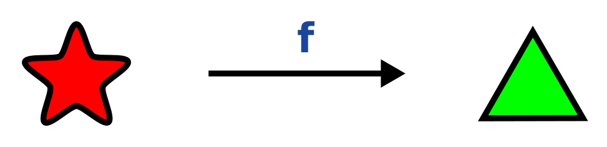
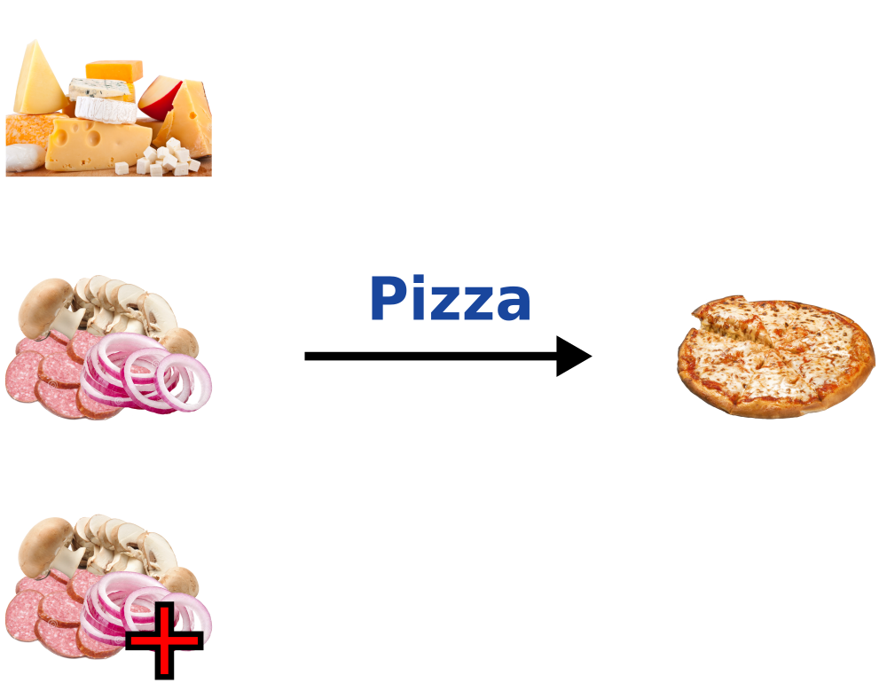
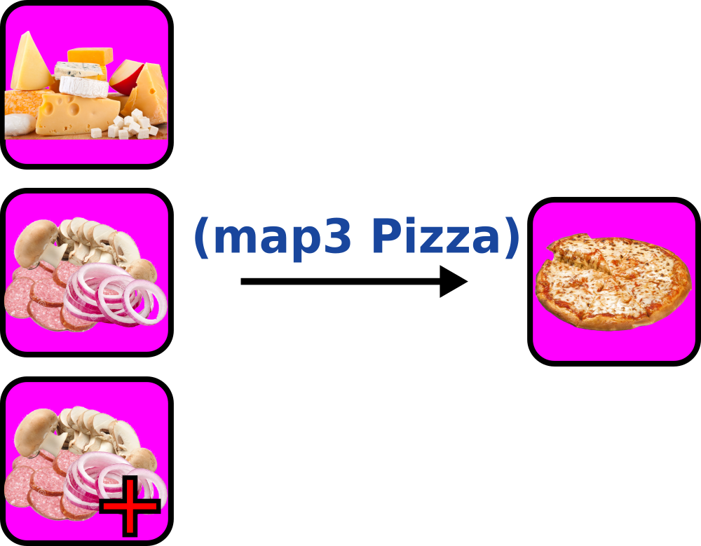

Introduction to random generators and function composition in Elm
=================================================================

This is based on a talk I originally gave at the [Elm Melbourne Meetup](https://www.meetup.com/Elm-Melbourne/),
the slides are [here](https://xarvh.github.io/talk-generators/#0).


## Random generators

A random generator is something that (duh!) generates pseudo-random values; for example
```elm
generator =
  Random.int 1 10
```
is a Generator that produces random integers between 1 and 10

As of 0.17, Elm provides two different ways to pull a value out of a generator:
`Random.step` and `Random.generate`:

```elm
(aRandomIntegerValue, newSeed) =
  Random.step generator oldSeed

cmd =
  Random.generate MsgRandomInt generator
```

`Random.step` works synchronously, but requires us to have (and manage) a random `Seed`.

`Random.generate` instead is asynchronous: it returns a command that generates the random value
and then triggers a dedicated message for our `update` function; since everything happens as a
side effect, there is no need to manually use seeds.

`Random.generate` seems more attractive, but it actually requires more boilerplate, and asynchronous
code in Elm tends to be messier and more prone to errors, so we want to focus on `Random.step`.


# Initializing the seed

Random seeds are usually initialized on the current time; however Elm is a purely functional language
and accessing the current time is inherently an _impure_ operation, since every time we ask for the
current time we get a different result.

The straighforward solution would be to use a side effect like `Time.now`, which would then trigger a
dedicated message for our `update` function.
This is exactly what we wanted to avoid by not using `Random.generate`, so we need a better way,
one that does not require any dedicated message and `update` calls.

By using `Html.App.programWithFlags` instead of just `Html.App.program` we can send stuff from
out JavaScript init code to our Elm init code; in our case, we'll send the return value of
JavaScript's `Date.now()`:
```js
Elm.Main.fullscreen(Date.now());
```

This value will be passed to the `init` function of `Html.App.programWithFlags`:
```elm
init : Int -> ( Model, Cmd Msg )
init dateNow =
    let
        initialModel =
            { seed = Random.initialSeed dateNow
            , ...
            }
    in
        ( initialModel, Cmd.none )
```

And that's it: we are ready to generate randomness without a single call to `update`.


# Generating complex stuff

I'm Italian, I like pizza, so of course I'll make a random pizza generator.

We all know that a [Marinara](https://it.wikipedia.org/wiki/Pizza_marinara) has no cheese,
a [Margherita](https://it.wikipedia.org/wiki/Pizza_Margherita) one (mozzarella!) and a
[Quattro formaggi](http://www.buonissimo.org/lericette/8246_Pizza_ai_quattro_formaggi) has four,
so it is perfectly reasonable to model the cheese as an integer.

For the topping, we'll use a union type.

```elm
type Topping =
    Onion | Mushroom | Sausage

type alias Pizza =
    { cheeseCount : Int
    , mainTopping : Topping
    , extraTopping : Maybe Topping
    }
```
(This also gives us a `Pizza : Int -> Topping -> Maybe Topping -> Pizza` constructor function)

We'll also use this:
```elm
int2topping : Int -> Topping
int2topping index =
    case index of
        0 -> Onion
        1 -> Mushroom
        _ -> Sausage
```


My first attempt at creating a similar generator looked something like this:
```elm
generatePizza seed0 =
    let
        (seed1, cheeseCount) =
            Random.step (Random.int 0 4) seed0

        (seed2, mainToppingIndex) =
            Random.step (Random.int 0 2) seed1

        (seed3, extraToppingIndex) =
            Random.step (Random.int 0 2) seed2

        (seed4, hasExtraTopping) =
            Random.step Random.bool seed3

        mainTopping =
            int2topping mainToppingIndex

        extraTopping =
            if hasExtraTopping
            then Just (int2topping extraToppingIndex)
            else Nothing

        randomPizza =
            Pizza cheeseCount mainTopping extraTopping
    in
        (randomPizza, seed3)
```
I have to drag along all those `seed*` values and I keep repeating calls to `Random.step`,
it is cluttered, prone to errors (I made one, can you find it?) and in general a pain in the
ass to read, understand and maintain.

I wrote it like this because I spent 20 years writing imperative, so I am used to manipulate *values*.

However, in a functional language, I want to manipulate *functions*.


## Manipulating functions with map

Let's consider:
```elm
List.map : (a -> b) -> List a -> List b
```
It is a function that takes a function `a -> b`, a `List a` and returns a `List b`.

But we can also see it in a different light:
```elm
List.map : (a -> b) -> (List a -> List b)
```
The parentheses I added don't change the actual meaning of the expression, we are still speaking
about the same `List.map`, it's just a different way to *think* about it.

`List a -> List b` is a *function*.

`List.map` takes a function as its first argument, and *returns a different function*.

`List.map` is *transforming* the function into another function.

What is this new function doing?

To understand it, let's see what happens if we apply `List.map` to a trivial function, such as `toFloat`:
```elm
toFloat : Int -> Float
```
```elm
(List.map toFloat) : List Int -> List Float
```

We transform a function `Int -> Float` into a function `List Int -> List Float`.

`(List.map toFloat)` takes a list of integers and returns a list of floats!

It is just like `toFloat`, only it works on lists!
We transformed a functiom that works on a single values into one that works on lists.

Of course, `List` is not the only "container" with a `map` function:
```elm
(Maybe.map toFloat) : Maybe Int -> Maybe Float
```
This would transform `Just` an integer into `Just` a float, while a `Nothing` would remain `Nothing`.


More in general, `map` transforms a function so that it acts in the *content* of a specific type of container:




Note: `map` *never changes the container*: an empty list would remain empty, a list with *N* elements
would still have *N* elements, a `Just` would remain a `Just` (but with a different value) and a `Nothing`
will still be a `Nothing`.


## A pizza topping generator

We could of course `map` on `int2topping`:
```elm
int2topping : Int -> Topping

(List.map int2topping) : List Int -> List Topping

(Maybe.map int2topping) : Maybe Int -> Maybe Topping
```

And guess what? There is a `Random.map` function!
```elm
(Random.map int2topping) : Generator Int -> Generator Topping
```
`(Random.map int2topping)` takes a generator of integers and transforms it into a generator of pizza toppings,
so we can take the integer generator we had at the very beginning, and turn it into a topping generator!

```elm
toppingGenerator : Generator Topping
toppingGenerator =
    Random.map int2topping
        (Random.int 0 2)
```


## Mapping many things together

What if our function has more than one argument?

We can't use `map` here!

Luckily, `map3` comes to our rescue:



`map3` is available for most "container" types, including `Random.Generator`:

```elm
(List.map3 Pizza) :
    List Int ->
    List Topping ->
    List (Maybe Topping) ->
    List Pizza

(Maybe.map3 Pizza) :
    Maybe Int ->
    Maybe Topping ->
    Maybe (Maybe Topping) ->
    Maybe Pizza

(Random.map3 Pizza) :
    Generator Int ->
    Generator Topping ->
    Generator (Maybe Topping) ->
    Generator Pizza
```

We need to feed to `(Random.map3 Pizza)` three random generators: one for the cheese count, one for the main topping
and one for the extra topping:

```elm
pizzaGenerator : Generator Pizza
pizzaGenerator =
    Random.map3 Pizza
        (Random.int 0 4)
        toppingGenerator
        (Random.Extra.maybe Random.bool toppingGenerator)
```

The cheese count and the main topping generators should be easy.
What about the third one, the extra topping generator?
We used this function:
```elm
Random.Extra.maybe : Generator Bool -> Generator a -> Generator (Maybe a)
```

`extraTopping` is of type `Maybe Topping`, so we need a `Generator (Maybe Topping)`.
If we compare this with the function annotation, it is clear that for our case `a` will be the
type `Topping`, so we'll need to call the function with a Bool generator and a Topping generator
as arguments.

The first argument is a generator used to decide whether we want `Just` something or `Nothing`.
`Random.bool` will yield equal probability for `True` and `False`, which is fine for us.
(`Random.Extra` contains function to generate different probability distributions.)

The second argument is the generator to use when the first one produces `True`, ie we need a
value for the `Just` case: we have this too, and it's our `toppingGenerator`.

Voila', we are ready to generate as much pizza as we want!

Our new shiny pizza generator is a lot more readable than my first attempt, and *so much* more
difficult to accidentelly screw up.


## Composition is general

This way of composing functions is very general: let's compare the pizza generator with a pizza JSON decoder:

```elm
pizzaGenerator : Generator Pizza
pizzaGenerator =
    Random.map3 Pizza
        (Random.int 0 4)
        toppingGenerator
        (Random.Extra.maybe Random.bool toppingGenerator)
```

```elm
pizzaJsonDecoder : Json.Decode.Decoder Pizza
pizzaJsonDecoder =
    Json.Decode.object3 Pizza
        ("cheeseCount" := Json.Decode.int)
        ("mainTopping" := toppingDecoder)
        (Json.Decode.maybe ("extraTopping" := toppingDecoder))
```

All the reasoning that we used to get to our pizza generator applies *as it is* to many other instances
where we use funciton composition: random generators, parsers, encoders, decoders and so on.

